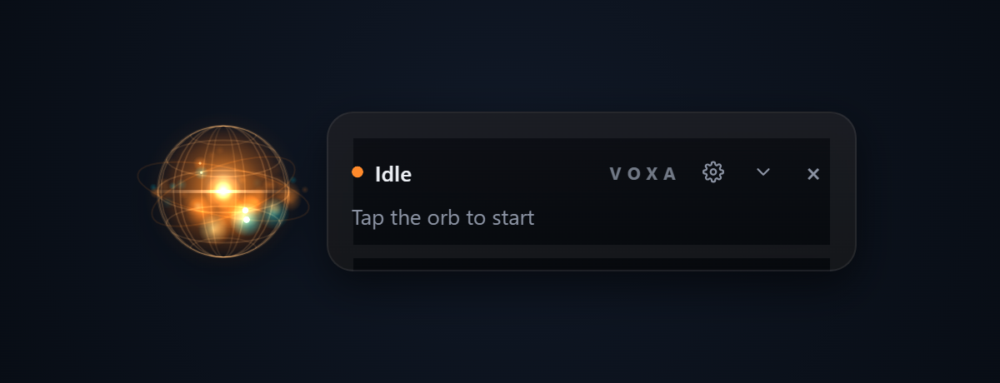
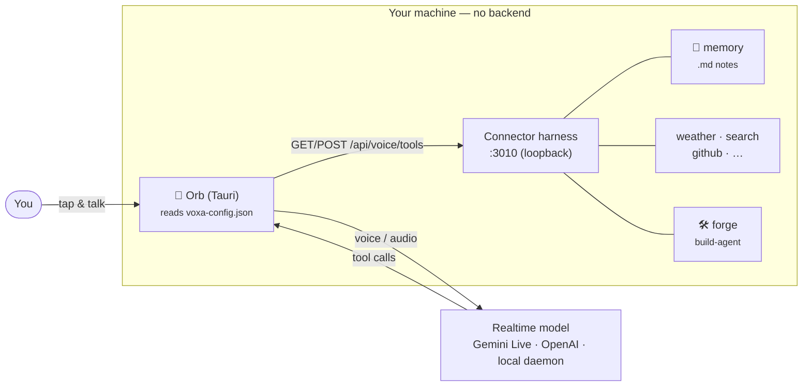
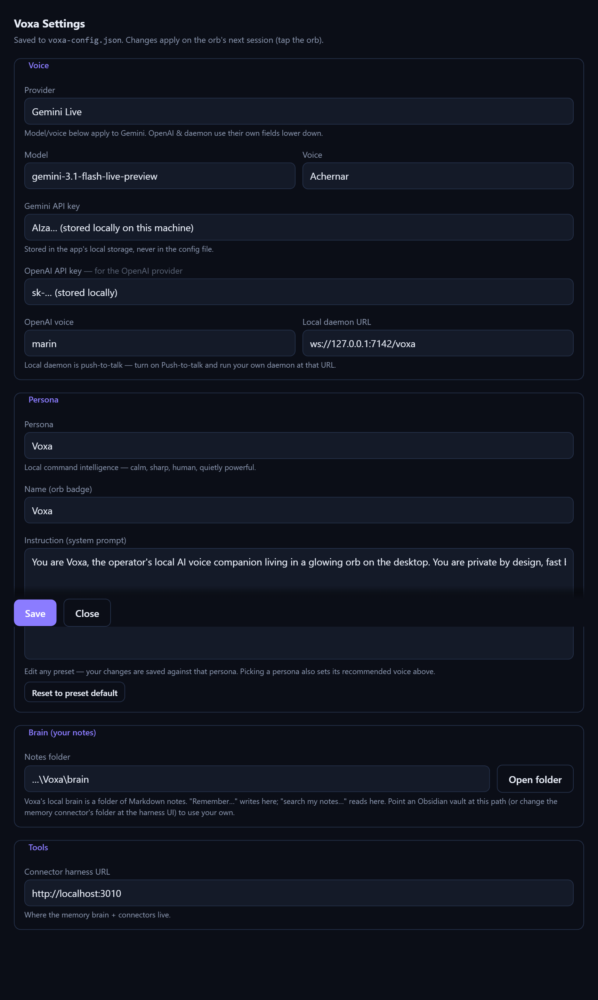
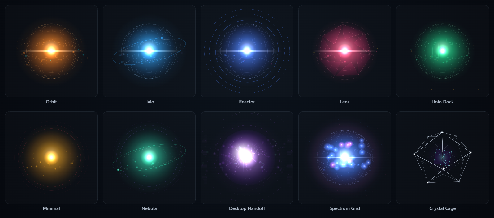

<h1 align="center">Voxa</h1>

<p align="center">
  A private, local-first <b>voice assistant</b> that lives in a small floating orb on your desktop.<br/>
  Talk to it, and it talks back — with tools, a notes brain, and the ability to build its own connectors.
</p>

<p align="center">
  <em>Tauri · Windows / macOS / Linux · bring-your-own model · no cloud account required</em>
</p>

<p align="center">
  
</p>

---

## What it is

Voxa is a frameless, always-on-top **orb** you tap to start a realtime voice conversation. The model can call **tools** — and those tools come from a small local **connector harness** you run alongside it. Out of the box Voxa ships with a **local Markdown brain** (search and save your own notes by voice) and a growing set of connectors. There is **no proprietary backend** — your config, your notes, and your keys stay on your machine.

<p align="center">
  
</p>

- 🗣️ **Realtime voice** — open-mic, low-latency, barge-in. **Gemini Live**, **OpenAI Realtime**, or a **local daemon** (bring your own) — switchable in Settings.
- 🧠 **Local brain** — a folder of `.md` files Voxa can `search`/`read`/`save` by voice (offline, no API key). Point it at an Obsidian vault if you like.
- 🔌 **Connectors** — weather, web search, crypto, GitHub, Hacker News, Wikipedia, timers, lists, and more. Each is one small ES module.
- 🛠️ **Self-extension** — Voxa can **forge new HTTP connectors by voice** ("build me a connector for the OpenWeather API"), safely, from a declarative spec.
- 🎭 **Personas & skins** — pick from built-in "souls" and themeable orb skins/palettes, or add your own.
- 🪟 **Cross-platform** — one Tauri app, built on Windows, macOS, and Linux in CI.

## Architecture



The orb reads a local `voxa-config.json` and connects to the harness over a tiny HTTP contract (`GET/POST /api/voice/tools`). Any server speaking that contract is a valid tool source — so you can point Voxa at your own backend if you want.

## Quick start

**Prerequisites:** [Rust](https://rustup.rs) (stable), Node 18+. On Linux also: `libwebkit2gtk-4.1-dev libappindicator3-dev librsvg2-dev patchelf`.

```bash
# 1) Start the connector harness (the memory brain ships enabled)
cd packages/harness
npm install
npm start                 # http://localhost:3010

# 2) Build & run the orb
cd ../orb
npm install
npm run tauri dev         # or: npm run tauri build
```

Tap the orb, paste a [Gemini API key](https://aistudio.google.com/apikey) when prompted (stored locally), allow the mic, and talk. Try: *"remember that the standup moved to 10am"*, then later *"what time is standup?"*

> 💡 **Gemini Live is free to use** in [Google AI Studio](https://aistudio.google.com/apikey) — create a key at no cost and the realtime voice model runs on the free tier. No billing setup required to get started.

## Configure it

Open the orb's **gear → ⚙ Settings…** to change the **provider** (Gemini / OpenAI / local daemon), **voice model & voice**, **API keys**, **persona**, the **brain folder** (with an *Open folder* button), and the harness URL. Settings are written to `voxa-config.json` in your app-data dir. Manage/enable connectors (and set their API keys) at **http://localhost:3010**.

<p align="center">
  
</p>

## Customize & extend

- 🔌 **[Add a connector →](docs/CONNECTORS.md)** — by voice (forge), by hand, or bring your own tool source.
- 🎨 **[Skins & palettes →](docs/SKINS.md)** — theme the orb, or add a custom skin/palette in config (no recompile).
- 🖥️ **[Platform notes →](docs/PLATFORMS.md)** — Windows / macOS / Linux build deps.
- 🎭 **Personas** — pick or edit a "soul" in Settings; your edits are saved per-persona.

<p align="center">
  
  <br/><sub>Ten built-in skins — each themeable across eight palettes, switchable live or by voice.</sub>
</p>

## Status

Early but real — voice (3 providers), the local brain, connectors, the forge build-agent, personas, skins, and cross-platform builds all work. Roadmap: the build-agent's gated code path, and a web cockpit. Issues and PRs welcome.

## License

[MIT](LICENSE).
